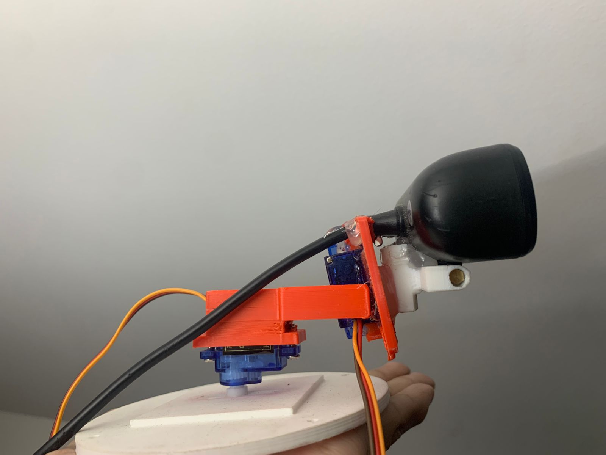

# Red Garment Tracker: Pan-Tilt Control System
### Raspberry Pi 5 + STM32F4 | Computer Vision & Embedded Control

Este proyecto implementa un sistema de seguimiento (tracking) de alta precisión para objetos de color rojo. La arquitectura es híbrida: utiliza una **Raspberry Pi 5** para el procesamiento de visión artificial pesada y un **STM32F407** para el control determinístico de servomotores, comunicados mediante un protocolo UART robusto.

---

## Demostración en Video
[](https://youtu.be/CwFZJvDF1Zw)
*Haz clic en la imagen para ver el sistema en acción.*

---

## Estructura del Sistema


---

## Características Principales

* **Detección de Doble Etapa:**
    * **CNN Gating:** Red neuronal MobileNetV2 cuantizada (TFLite) que valida la presencia de una persona/prenda antes de activar el rastreo.
    * **Visión Tradicional:** Segmentación en espacio de color HSV y filtrado de blobs mediante OpenCV.
* **Control de Movimiento Inteligente:**
    * **Eje Pan (360°):** Algoritmo de pulsos variables. La duración del pulso `ON` es proporcional al error de píxeles, eliminando el jitter.
    * **Eje Tilt (180°):** Control proporcional suavizado con filtro de media móvil.
* **Comunicación Sincronizada:** Protocolo UART con handshake (`READY`, `HELLO`, `HELLO_OK`) a 115200 bps.

---

## Stack Tecnológico

### Hardware
* **Procesamiento:** Raspberry Pi 5 (8GB RAM).
* **Microcontrolador:** STM32F407 Discovery / BlackPill (Cortex-M4).
* **Actuadores:** 2x Servomotores (Pan/Tilt).
* **Cámara:** Sensor de alta tasa de refresco (30+ FPS).

### Software
* **Lenguajes:** Python 3.11 & C (HAL Libraries).
* **IA:** TensorFlow Lite (MobileNetV2).
* **Visión:** OpenCV 4.x.
* **Firmware:** Desarrollado en STM32CubeIDE.

---

## 📐 Diagrama de Flujo
1. **Captura:** RPi 5 adquiere frame -> Procesa CNN Gating.
2. **Cómputo:** Si hay detección, calcula error $e_x, e_y$ en píxeles.
3. **Serial:** Envío de comandos `PAN <cmd>` y `TILT <us>`.
4. **Actuación:** STM32 recibe interrupción (IT) -> Actualiza registros PWM del Timer 4.

---

## Estructura del Proyecto

```text
├── rpi_vision/             # Lógica de visión y gating en Python
│   ├── models/             # Modelos TFLite optimizados
│   └── tracker_main.py     # Script principal de la RPi 5
├── stm32_firmware/         # Código fuente en C (CubeIDE project)
│   ├── Core/Src/main.c     # Parser UART y control de Timers
│   └── Core/Inc/main.h
├── docs/                   # Diagramas y recursos visuales
└── README.md
